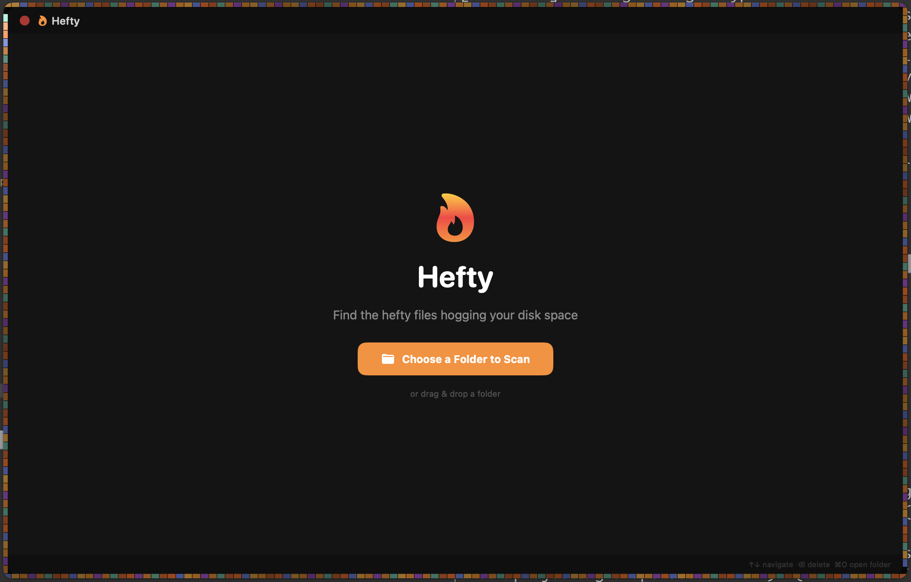
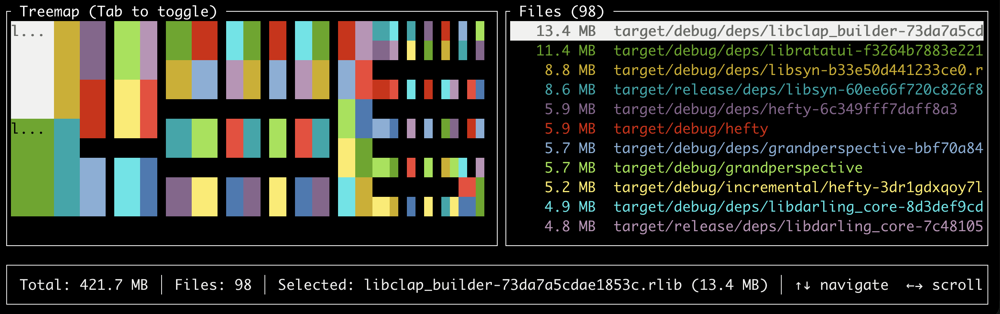

# hefty

A fast disk usage analyzer inspired by [GrandPerspective](https://grandperspectiv.sourceforge.net/) — available as both a **CLI tool** and a **native macOS app**. Find the hefty files hogging your disk space.





## Features

- **Native macOS app** — beautiful GUI with drag-and-drop folder scanning, Trash-safe deletes, Quick Look
- **Fast CLI tool** — parallel directory walking with `jwalk`, hardlink-aware
- **Interactive TUI** — treemap visualization + scrollable file list powered by `ratatui`, with mouse support
- **Directory drill-down** — `t` opens a tree view; descend into directories to find heavy folders
- **Duplicate detection** — `u` finds identical files (size + BLAKE3 hash) and shows reclaimable space
- **Trash-safe deletes** — `d` moves to Trash (recoverable); `X` deletes permanently
- **File-type coloring** — treemap and list colored by category (video, archive, code, ...)
- **Search** — `/` filters the file list as you type
- **List mode** — non-interactive output for scripting; `--format json` / `--format csv` for machine-readable export
- **Configurable** — min file size, top N, `--exclude` globs, `--one-file-system`, `--du` for real disk usage

## Install

### Homebrew

```sh
brew tap schlunsen/tap
brew install hefty
```

### Cargo

```sh
cargo install --git https://github.com/schlunsen/hefty
```

### From source

```sh
git clone https://github.com/schlunsen/hefty.git
cd hefty
cargo build --release
./target/release/hefty --help
```

## Usage

```
hefty [OPTIONS] [PATH]

Arguments:
  [PATH]  Directory to scan [default: .]

Options:
  -m, --min-size <MIN_SIZE>  Minimum file size to show [default: 1MB]
  -n, --top <TOP>            Show top N largest files [default: 100]
  -l, --list                 Print results and exit (no interactive UI)
  -f, --format <FORMAT>      Output format for list mode [default: table] [possible values: table, json, csv]
      --du                   Report actual disk usage (allocated blocks) instead of apparent size
  -e, --exclude <EXCLUDE>    Exclude paths matching a glob pattern (repeatable)
  -x, --one-file-system      Stay on one filesystem (don't cross mount points)
  -h, --help                 Print help
  -V, --version              Print version
```

### Interactive TUI

```sh
hefty ~
```

Opens a terminal UI with a treemap visualization and a scrollable file list sorted by size.

**Keyboard shortcuts:**

| Key | Action |
|-----|--------|
| `↑` / `k` | Move up |
| `↓` / `j` | Move down |
| `Page Up` / `Page Down` | Scroll fast |
| `Home` / `End` | Jump to top / bottom |
| `Tab` | Toggle treemap view |
| `Space` | Mark/unmark file for batch operations |
| `a` / `A` | Mark all / unmark all |
| `d` | Move selected (or marked) files to Trash |
| `X` | Permanently delete selected (or marked) files |
| `/` | Search / filter the file list |
| `t` | Toggle directory drill-down (tree) view |
| `Enter` | Tree view: descend into directory; otherwise file info |
| `Backspace` | Tree view: go up a directory |
| `u` | Toggle duplicate finder (size + BLAKE3 hash) |
| `o` | Reveal selected file in Finder / file manager |
| Mouse | Click to select (list or treemap), scroll wheel to navigate |
| `q` / `Esc` | Quit (Esc first clears search / leaves sub-views) |

### List mode

```sh
hefty ~/projects --list -n 10 --min-size 100MB
```

```
        SIZE  PATH
────────────────────────────────────────────────────────────────────────────────
      1.5 GB  legalize-es/.index_cache/es_index.pkl
    724.0 MB  clovr-cat/desktop/clovr
    719.7 MB  clovr-cat/desktop/build/bin/clovr
    652.2 MB  clovr-cat/desktop/frontend/public/models/encoder-model.int8.onnx
    621.9 MB  legalize-dk/.index_cache/dk_index.pkl
    530.7 MB  legalize-de/.index_cache/de_index.pkl
    444.4 MB  src-tauri/target/debug/libwee_desktop_lib.a
    444.4 MB  src-tauri/target/debug/deps/libwee_desktop_lib.a
    248.6 MB  src-tauri/target/release/bundle/macos/Donna_1.0.0_aarch64.dmg
    248.5 MB  src-tauri/target/release/bundle/macos/Donna_1.0.0_aarch64.dmg
────────────────────────────────────────────────────────────────────────────────
     39.5 GB  Total scanned
```

## Development

Requires [just](https://github.com/casey/just) as a task runner.

```sh
just          # list available recipes
just build    # debug build
just release  # release build
just run ~    # run interactive TUI
just list . 20 1MB  # list mode (path, top N, min size)
just check    # fmt + clippy + tests
just fmt      # format code
just lint     # clippy lints
just test     # run tests
just clean    # clean build artifacts
```

## License

MIT
